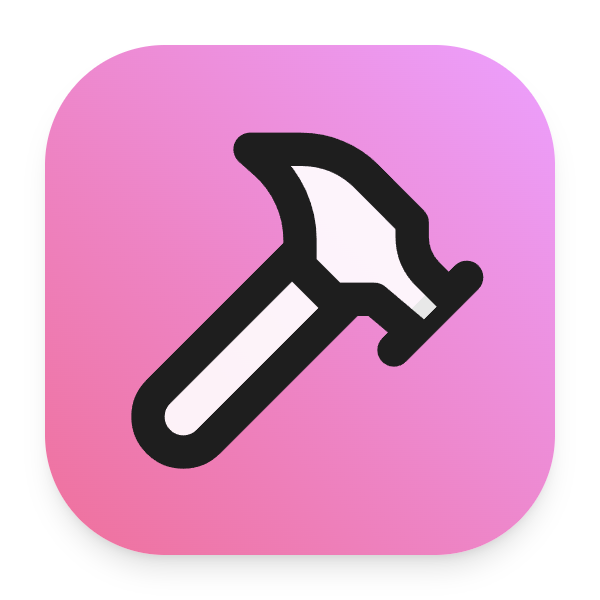

<p align="center">
  
</p>

<h1 align="center">HexelUI</h1>

<p align="center">
  Copy, paste, ship: React components for SaaS
</p>

<p align="center">
  <a href="https://github.com/ThelzenGroup/HexelUI/actions/workflows/ci.yml"></a>
  <a href="https://github.com/ThelzenGroup/HexelUI/blob/main/LICENSE"></a>
  <a href="https://www.npmjs.com/package/@hexelui/cli"></a>
</p>

---

## Why HexelUI?

HexelUI is an open-source React UI kit for SaaS — built on [Radix UI](https://www.radix-ui.com/) primitives for accessibility, styled with [Tailwind CSS](https://tailwindcss.com/) for complete customization, and distributed as copy-paste components so you own the code forever.

No package updates. No breaking changes. No lock-in.

## Features

- **Copy-paste model** — components live in your codebase, not a node_modules folder
- **Accessible by default** — built on Radix UI primitives with full keyboard navigation and ARIA support
- **Dark mode** — CSS variable-based theming, zero `dark:` prefix clutter
- **TypeScript** — full type safety and autocompletion out of the box
- **Tailwind CSS** — semantic color tokens that map to your design system
- **CLI tool** — `npx hexelui add button` writes the component directly to your project

## Quick Start

```bash
# Initialize HexelUI in your project
npx hexelui init

# Add components
npx hexelui add button
npx hexelui add input card dialog
```

## Usage

```tsx
import { Button } from '@/components/ui/button'

export default function App() {
  return <Button variant="default">Get Started</Button>
}
```

## Documentation

Full documentation available at [hexelui.dev](https://hexelui.dev) _(coming soon)_

Browse components, view live previews, and copy installation commands.

## Components

**v0.1.0 — Foundation**

| Component | Description |
|-----------|-------------|
| Button | Trigger actions and navigation |
| Input | Text entry fields |
| Label | Accessible form labels |
| Card | Content containers |
| Badge | Status and category indicators |
| Alert | Contextual feedback messages |
| Separator | Visual dividers |
| Avatar | User and entity representations |
| Checkbox | Binary selection controls |
| Switch | Toggle on/off states |
| Select | Dropdown selection |
| Tabs | Tabbed navigation panels |
| Tooltip | Contextual hover information |
| Dialog | Modal overlays |
| Dropdown Menu | Contextual action menus |
| Toast | Non-blocking notifications |

## Contributing

Contributions are welcome. Read the [Contributing Guide](.github/CONTRIBUTING.md) to get started.

- [Report a bug](https://github.com/ThelzenGroup/HexelUI/issues/new?template=bug_report.yml)
- [Request a component](https://github.com/ThelzenGroup/HexelUI/issues/new?template=component_request.yml)
- [Start a discussion](https://github.com/ThelzenGroup/HexelUI/discussions)

## Acknowledgments

HexelUI is inspired by and built on the shoulders of:

- [shadcn/ui](https://ui.shadcn.com/) — the copy-paste distribution model
- [Radix UI](https://www.radix-ui.com/) — accessible component primitives
- [Tailwind CSS](https://tailwindcss.com/) — utility-first styling

## License

MIT — [ThelzenGroup](https://github.com/ThelzenGroup)
